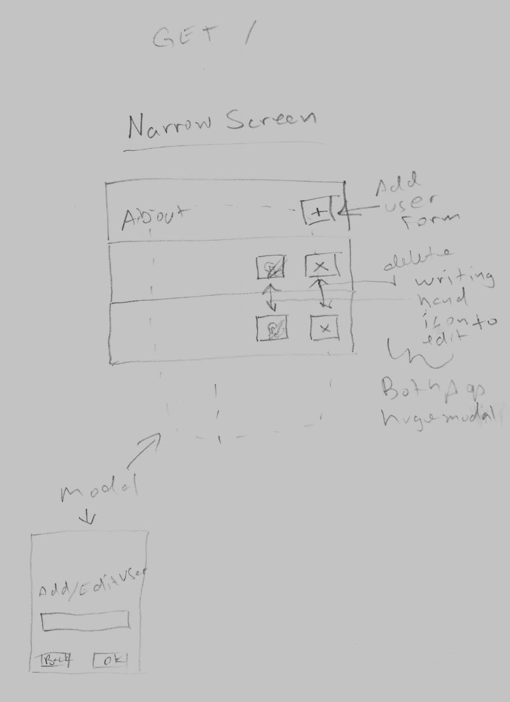
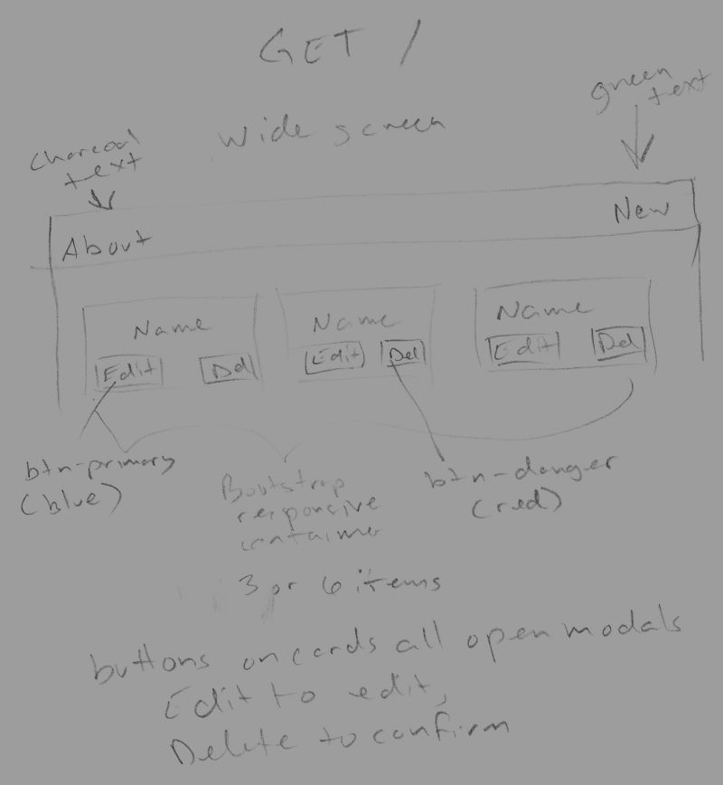
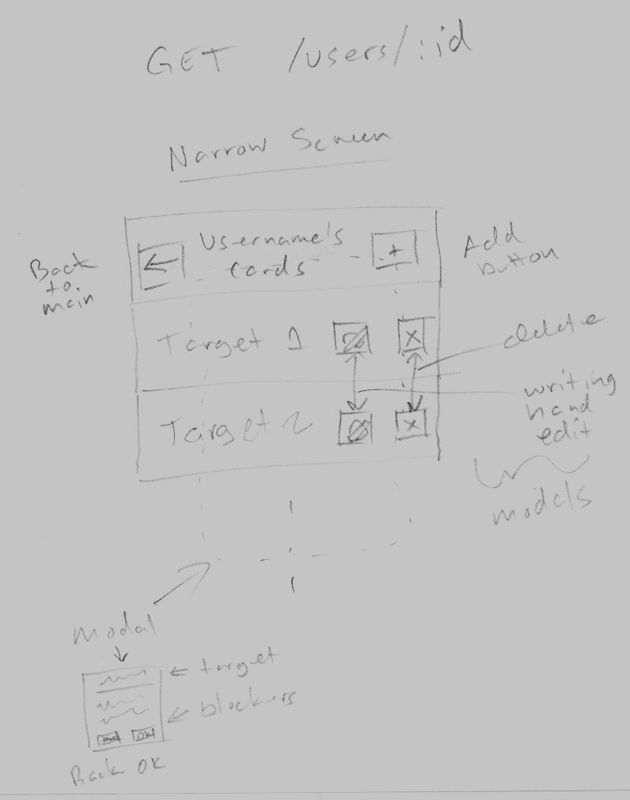
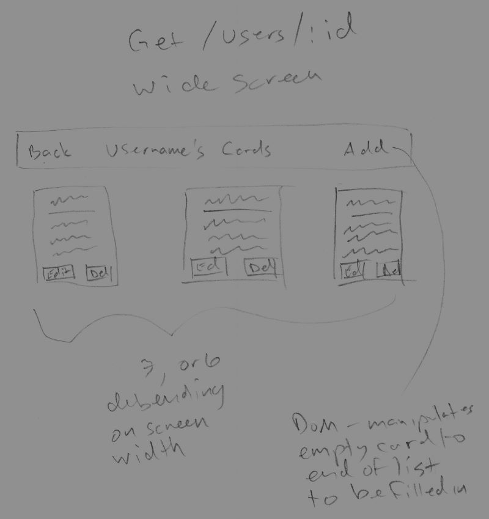
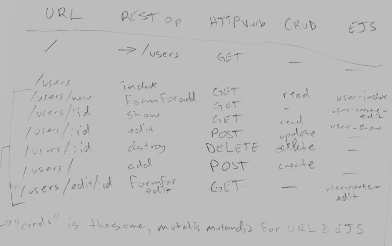
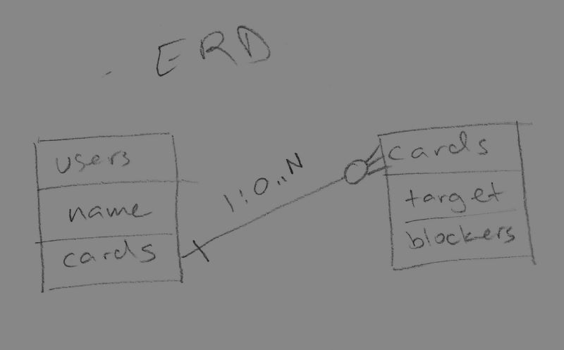

# taboo-card-editor
Website users can CRUD user accounts, and having chosen a user account, can CRUD cards as that user.  Should be modular enough to be adapted to serve as a config component of a larger project where you can play the game online, later.

