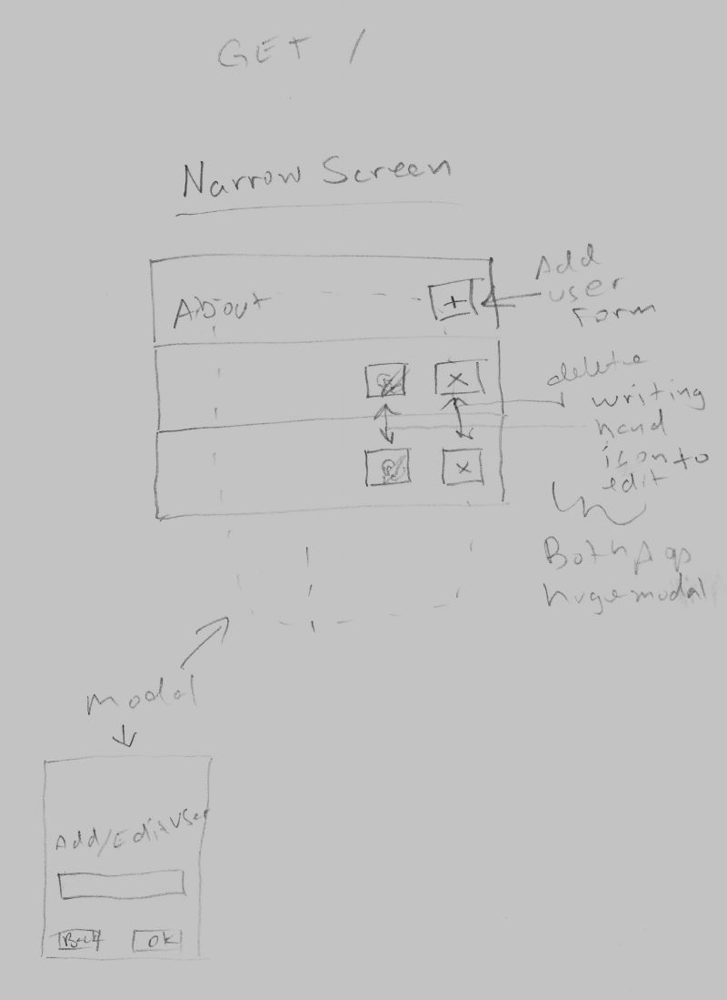
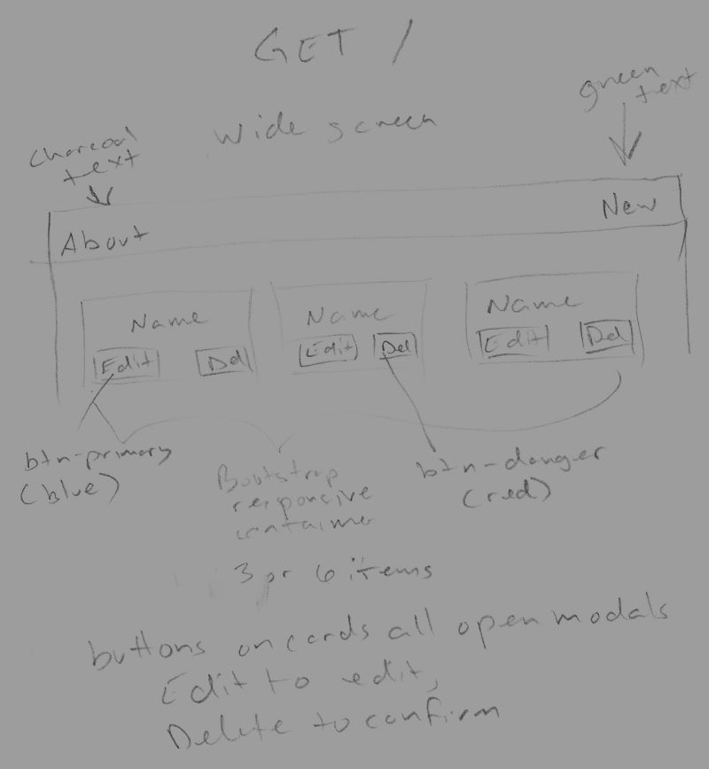
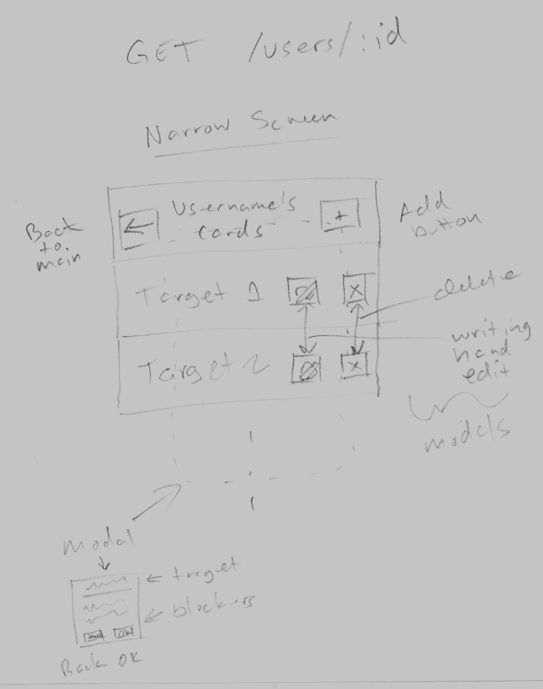
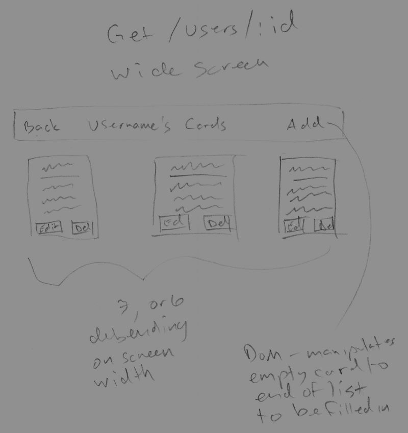
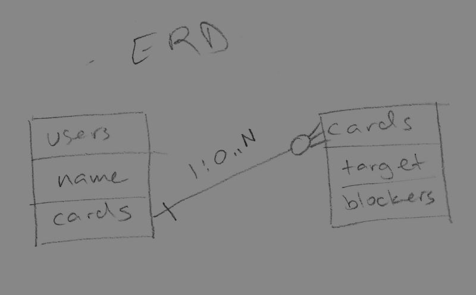
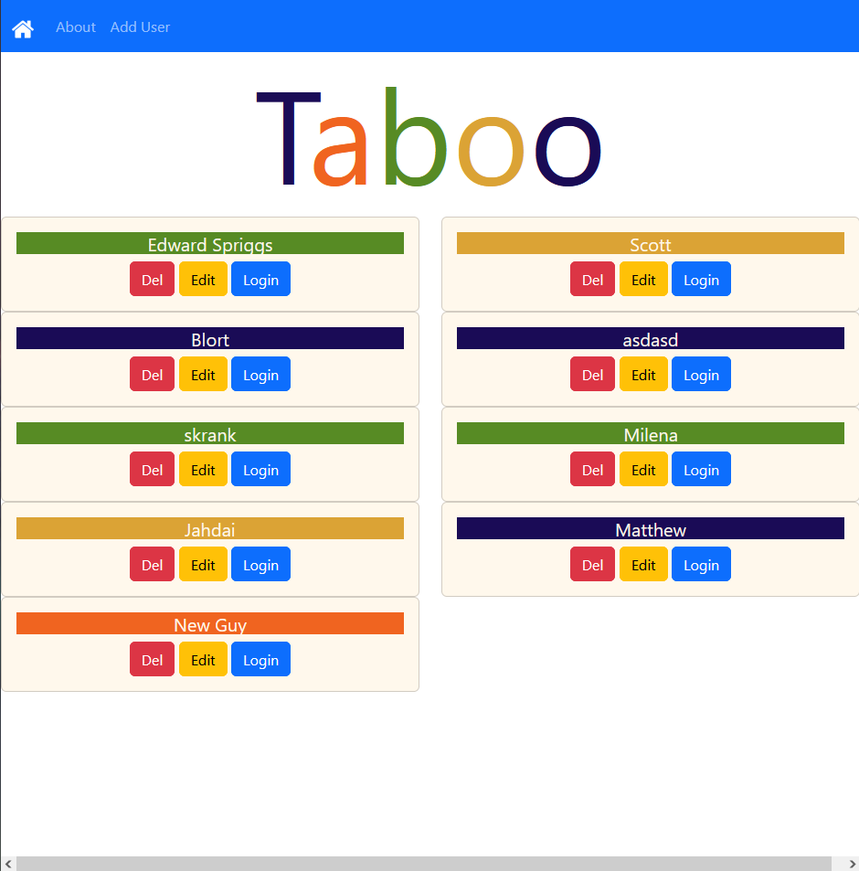
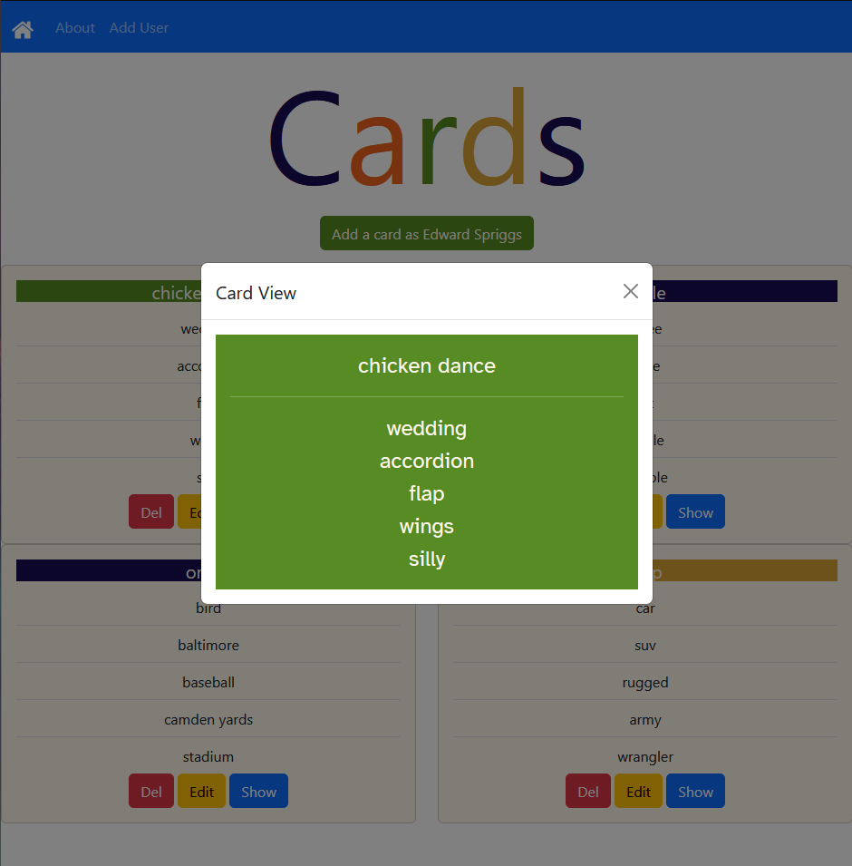

# Deployment
[Test deployment available here](https://taboo-editor-2294c73d3be1.herokuapp.com)

# Taboo Card Editor
Website users can CRUD user accounts, and having chosen a user account, can CRUD cards as that user.  Should be modular enough to be adapted to serve as a config component of a larger project where you can play the game online, later.

# MVP Routing Table
## no user authentication, cards organized as a nested resource inside users

| URL                           | REST Operation     | HTTP Verb | CRUD Action   | EJS View             |
| :---------------------------- | :----------------- | :-------: | :-----------: | :------------------- |
| /nuke                         | N/A                | GET       | delete/create | N/A                  |
| /                             | redirect: /users   | GET       | N/A           | N/A                  |
| /users                        | index              | GET       | read          | index-users.ejs      |
| /users/new                    | form for creation  | GET       | N/A           | user-create-edit.ejs |
| /users/:user                  | show               | GET       | read          | user-show.ejs        |
| /users/:user/edit             | form for edit      | GET       | read          | user-create-edit.ejs |
| /users                        | add                | POST      | create        | N/A                  |
| /users/:user                  | edit               | PUT       | update        | N/A                  |
| /users/:user                  | destroy            | DELETE    | delete        | N/A                  |
| /users/:user/cards            | index              | GET       | read          | index-cards.ejs      |
| /users/:user/cards/new        | form for creation  | GET       | N/A           | card-create-edit.ejs |
| /users/:user/cards/:card/edit | form for edit      | GET       | read          | card-create-edit.ejs |
| /users/:user/cards            | add                | POST      | create        | N/A                  |
| /users/:user/cards/:card      | edit               | PUT       | update        | N/A                  |
| /users/:user/cards/:card      | destroy            | DELETE    | delete        | N/A                  |

# Stretch Routing Table
## user authentication via oauth, card routes changed to be shallow

| URL             | REST Operation     | HTTP Verb | CRUD Action   | EJS View             |
| :-------------- | :----------------- | :-------: | :-----------: | :------------------- |
| /nuke           | N/A                | GET       | delete/create | N/A                  |
| /               | redirect: /users   | GET       | N/A           | N/A                  |
| /users          | index              | GET       | read          | index-users.ejs      |
| /users/new      | form for creation  | GET       | N/A           | user-create-edit.ejs |
| /users/:id      | show               | GET       | read          | user-show.ejs        |
| /users/:id/edit | form for edit      | GET       | read          | user-create-edit.ejs |
| /users          | add                | POST      | create        | N/A                  |
| /users/:id      | edit               | PUT       | update        | N/A                  |
| /users/:id      | destroy            | DELETE    | delete        | N/A                  |
| /cards          | index              | GET       | read          | index-cards.ejs      |
| /cards/new      | form for creation  | GET       | N/A           | card-create-edit.ejs |
| /cards/:id/edit | form for edit      | GET       | read          | card-create-edit.ejs |
| /cards          | add                | POST      | create        | N/A                  |
| /cards/:id      | edit               | PUT       | update        | N/A                  |
| /cards/:id      | destroy            | DELETE    | delete        | N/A                  |

# Screenshots

## Users view (landing page)

## Cards view for a user, showing card rendering modal

# Technologies used

* MongoDB
* Atlas
* Mongoose
* Node.js
* Express.js
* EJS 
* Bootstrap
* Heroku

House asset is the 24px png version of https://www.iconsdb.com/white-icons/house-icon.html (CC0 public domain)

# Installation instructions

* One requirement is Node, which is available for various platforms here: https://nodejs.org/en/download.
* The downloads above include npm, which can fetch all other web-server-side software dependencies automatically via the command "npm i".
* Bootstrap is downloaded from Bootstrap's CDN automatically by browsers when using the app.
* MongoDB with hosting is required, e.g. from here: https://www.mongodb.com/atlas/database
* The application is configured with the following environment variables:
    - PORT: the port on which the web server should listen (on Heroku, this is set automatically)
    - ON_HEROKU: "false" or "true", controls dev-only options, including file monitor and auto-restart, and the "nuke" option that deletes all database data and populates the database with some test info
    - MONGODBURI: the Mongo connection string of a database that allows writes for the user whose string it is
* The variables can be set in the actual environment, or in 'KEY=VALUE' format on separate lines in a file named .env that is added to the root of the application directory
* In dev, the application can be started with "npm run dev" to enable the "/nuke" route and its navbar link, and to enable some dev-only convenience features
* In prod, the application can be started with "node server.js", but it is not necessary for the user to do this manually on Heroku

# User stories

* I like the game Taboo and I want to play it
* I'm curious what Edward has been working on
* I want to know if this Spriggs guy is any good at web apps

# Unsolved problems

* Implement OAuth, instead of taking people's word for who they are and what user accounts should exist.
* Better user interface design.  Gotta think more granularly about use cases and flow.
* Some kind of backup and restore functionality.
* Implement the actual game (multiple users drawing cards from a shared deck)
* Implement per-user deck preferences (i.e. "that card sucks; when I make a game I don't want to use it").
* Visible user primary key is "Name" field, but the real PK is a generated Object ID field that isn't visible, and names can be duplicated

# Next steps

OAuth for sure, since other stuff depends on that.  "cards" REST endpoints are currently subtrees of the particular-user parts of the "users" REST endpoints, but this is designed to be easily changed later.  Cards should come to the top level once user auth is available.

Some "placeholder" stuff gives this application the structure appropriate to a school assignment and can be changed after it's graded, e.g. it makes more sense to select card color on a per-card basis with the color of the previous card entered as a default, instead of having it as a user property, but it's currently implemented as a user property, because the entire user part of the application is a placeholder for my OAuth stretch goal, and the "users" part of the application needed more to do, in the meantime.